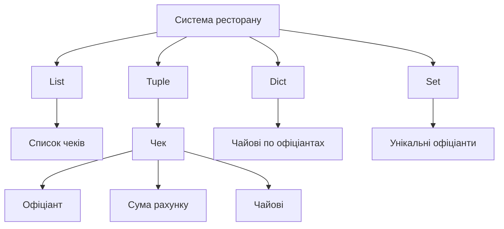
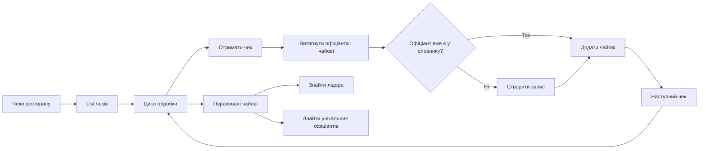
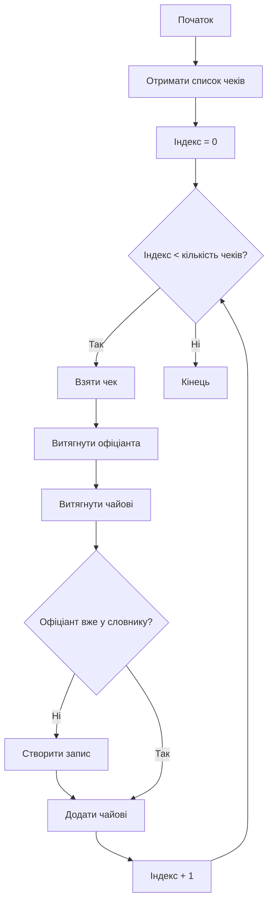
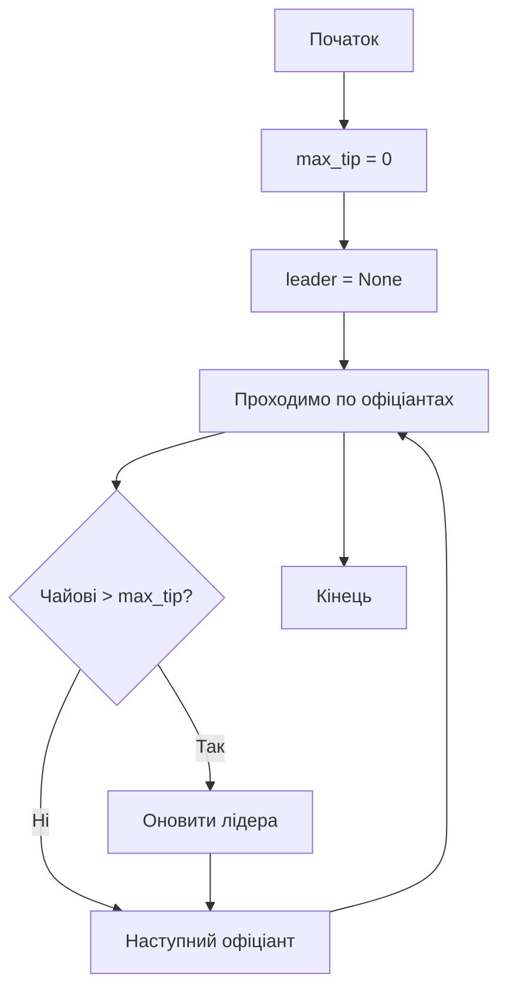
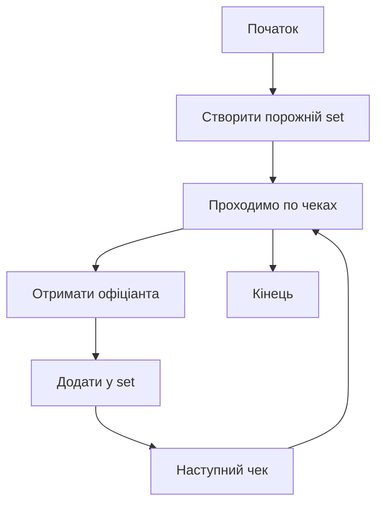
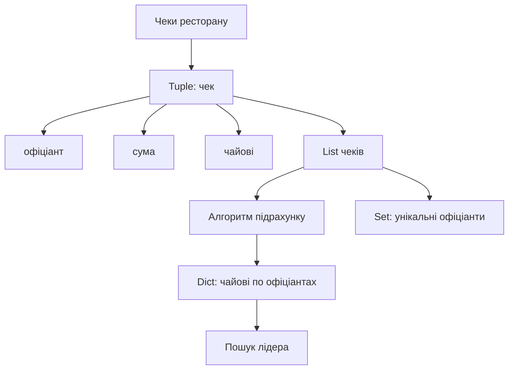

# Алгоритмічне мислення у Python

## Приклад: система ресторану

Цей приклад показує **як працює програмування на практиці**.

Ми створюємо маленьку систему ресторану, де Python:

* обробляє чеки
* рахує чайові
* знаходить найкращого офіціанта
* визначає унікальних офіціантів

Головна ідея програмування:

```
дані → алгоритм → результат
```

---

# 1. Архітектура даних

Спочатку потрібно зрозуміти **які структури даних ми використовуємо**.




```
дані → структура даних
```

---

# 2. Як течуть дані у програмі

Це **найважливіша схема** — вона показує **як працює програма**.



Це модель **потоку даних**:

```
дані → обробка → результат
```

---

# 3. Алгоритм обробки чеків

Це класичний алгоритм:



Це демонструє **основу програмування**:

```
ініціалізація
цикл
умова
оновлення
```

---

# 4. Алгоритм пошуку лідера



класичний алгоритм:

```
порівняння
оновлення
пошук максимуму
```

---

# 5. Алгоритм створення унікальних офіціантів



Особливість `set`:

```
він автоматично прибирає дублікати
```

---

# 6. Повна логіка програми



---

# 7. Формула алгоритмічного мислення

Будь-яку задачу у програмуванні можна розкласти так:

```
ДАНІ → ЦИКЛ → УМОВА → ОНОВЛЕННЯ → РЕЗУЛЬТАТ
```

Приклад у цій задачі:

```
orders → while → waiter in dict? → додати чайові → leaderboard
```

---

# 8. Відповідність алгоритму і Python

| Алгоритм        | Python                         |
| --------------- | ------------------------------ |
| цикл            | `while`                        |
| умова           | `if`                           |
| структура даних | `list`, `dict`, `set`, `tuple` |
| результат       | `print()`                      |

---

# Головна ідея уроку

Програмування — це не написання коду.

Це **управління потоком даних**.

```
дані → структура → алгоритм → результат
```

Python — це просто **інструмент для реалізації цієї логіки**.

---
