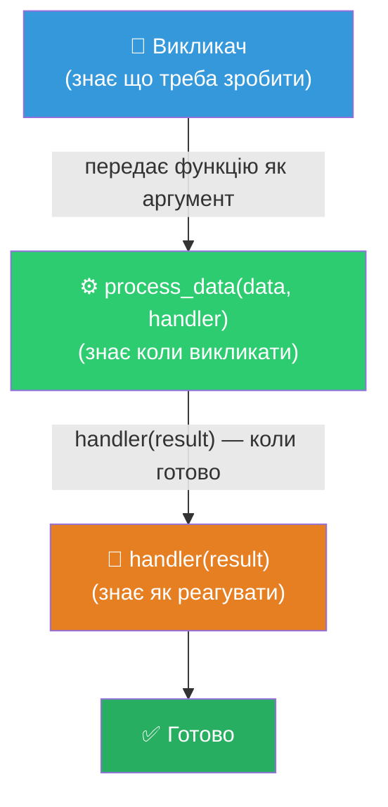
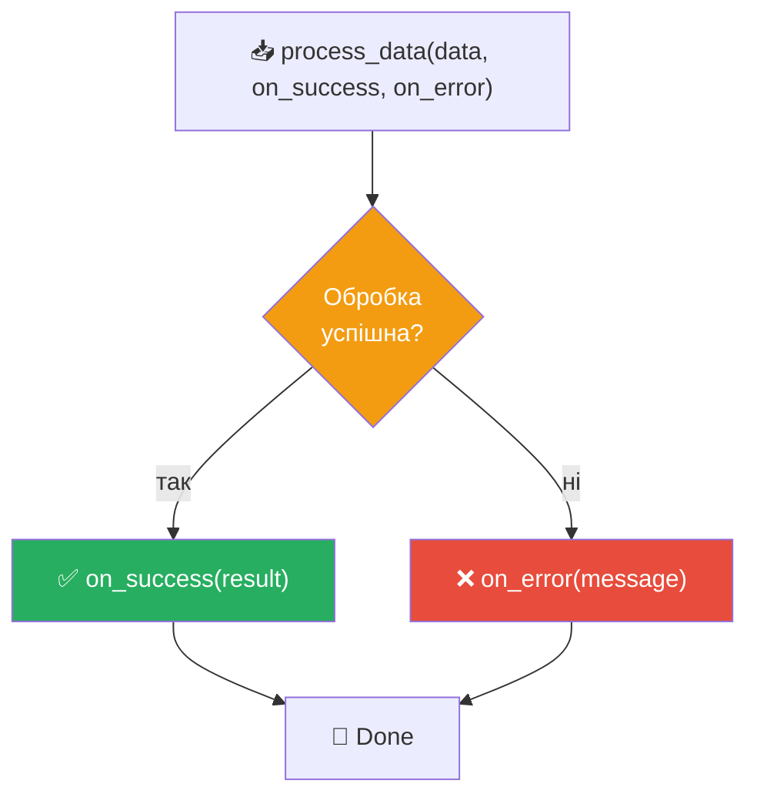
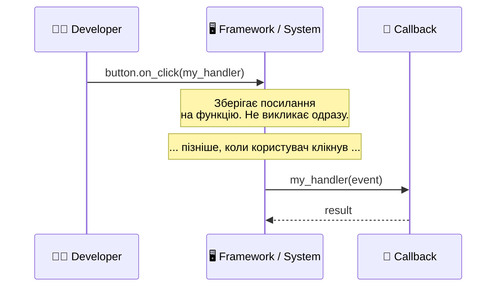

# Патерн 1: Callback (Зворотний виклик)

> **Рівень:** Beginner → Intermediate
> **Урок:** 13 — Functions as First-Class Objects
> **Модуль:** Module 2 — Python Intermediate

---

> 🧭 **Цей файл — не визначення. Це подорож.**
> Ти сам відкриєш патерн Callback через реальну проблему.

---

## 🔴 Крок 1 — Проблема

Є функція, яка обробляє дані:

```python
def process_data(data):
    result = data * 2
    print(f"Результат: {result}")
```

Все працює. Але приходить нове завдання:

> «Іноді треба друкувати результат. Іноді — зберігати у файл. Іноді — відправляти в API.»

---

❓ **Питання до тебе:**
Як би ти це вирішив? Подумай хвилину перед тим, як читати далі.

---

## 🟡 Крок 2 — Наївне рішення

Перше, що спадає на думку — додати параметр `mode`:

```python
def process_data(data, mode):
    result = data * 2

    if mode == "print":
        print(f"Результат: {result}")
    elif mode == "save":
        save_to_file(result)
    elif mode == "api":
        send_to_api(result)
```

Виглядає логічно. Але подивись уважніше.

---

❓ **Питання:**
Що станеться, коли з'явиться четвертий варіант? П'ятий? Десятий?

> Відповідь: функція буде рости нескінченно. Кожне нове завдання — ще один `elif`. Функція, яка мала обробляти дані, перетворюється на монстра, що знає все про всі можливі виходи.

---

## 🔴 Крок 3 — Три причини, чому це погано

```
❌ Функція порушує SRP (Single Responsibility Principle)
   → вона і обробляє дані, і вирішує що з ними робити

❌ Функцію важко тестувати
   → щоб перевірити обробку, треба ще й мокати save_to_file і send_to_api

❌ Систему важко розширювати
   → кожне нове джерело даних потребує зміни self функції
```

---

❓ **Питання:**
Яка саме частина функції є «чужою»? Що вона робить таке, що не є її справою?

> Відповідь: рядки з `print`, `save_to_file`, `send_to_api` — це **не обробка даних**. Це **реакція на результат**. `process_data` не повинна знати про це нічого.

---

## 💡 Крок 4 — Ідея: винести «що робити» назовні

Якщо функція не повинна знати, що робити з результатом — хай **хтось інший це скаже**.

```
Функція: «Я вмію обробляти дані. Але що робити з результатом — вирішуй ти.»
Викликач: «Окей, ось функція — виконай її, коли буде готово.»
```

---

❓ **Питання:**
Якщо функцію можна передати як аргумент (ти це вже знаєш з уроку 13) — як би виглядала нова сигнатура `process_data`?

---

## 🤯 Крок 5 — Злом: передаємо функцію

```python
def handle_result(result):
    print(f"Результат: {result}")

# Передаємо функцію як аргумент — БЕЗ дужок!
def process_data(data, handler):
    result = data * 2
    handler(result)      # викликаємо тоді, коли готово


process_data(10, handle_result)   # Результат: 20
```

Зупинись і перечитай рядок `handler(result)`.

`process_data` не знає, що таке `handle_result`. Вона знає лише одне: «є якась функція, і я маю викликати її з результатом». **Що саме вона зробить — не моя справа.**

---

❓ **Питання:**
Хто тут знає **коли** викликати? А хто знає **що** робити?

> Відповідь:
> - `process_data` знає **коли** (коли обробка завершена)
> - `handle_result` знає **що** (надрукувати)
>
> Ці дві відповідальності тепер розділені.

---

🧩 **Мінівправа:**
Напиши дві функції-обробники: `save_result(result)` і `send_to_api(result)`. Викликай `process_data` тричі — з різними обробниками. Переконайся, що сама `process_data` не змінюється.

---

## 💥 Крок 6 — Назва

Функція, яку ти **передаєш** іншій функції, щоб та викликала її «потім» — це і є **callback**.

```
callback = "передзвони мені"
```

```
process_data → знає КОЛИ викликати
handler      → знає ЩО робити
```

Ти не вигадав нічого нового. Ти просто зрозумів, чому це патерн.

---

## 🍕 Крок 7 — Аналогія: замовлення піци

```
Ти замовляєш піцу і залишаєш номер телефону.

Ти (викликач)   → передаєш номер (callback)
Піцерія         → process_data (знає коли дзвонити)
Твій телефон    → handle_result (знає що робити коли подзвонять)

Піцерія не знає, що ти будеш робити коли зателефонують.
Їй байдуже. Її справа — приготувати піцу і натиснути кнопку дзвінка.
```

Саме так працює callback у коді.

---

## ⚠️ Крок 8 — Критична помилка початківців

Ось помилка, яку роблять усі хоча б раз:

```python
# ❌ НЕПРАВИЛЬНО — викликаємо функцію одразу!
process_data(10, handle_result())

# ✅ ПРАВИЛЬНО — передаємо об'єкт функції
process_data(10, handle_result)
```

Різниця між `handle_result` і `handle_result()`:

| Запис | Що це | Результат |
|---|---|---|
| `handle_result` | Сам об'єкт функції | Передається як аргумент |
| `handle_result()` | Виклик функції прямо зараз | Передається **результат** (можливо `None`) |

---

❓ **Питання:**
Що станеться, якщо `handle_result()` повертає `None`, і `process_data` спробує викликати цей `None` як функцію?

> Відповідь: `TypeError: 'NoneType' object is not callable`. Python скаже, що `None` не можна викликати.

---

🧩 **Мінівправа-пастка:**
Запусти обидва варіанти і подивись на помилки. Запам'ятай відчуття від `TypeError` — ти зустрінеш цю помилку в реальному коді.

---

## ⚙️ Крок 9 — Реальний патерн: Success / Error

У реальних системах обробка може завершитись успіхом або помилкою. Callback можна мати два:

```python
def process_data(data, on_success, on_error):
    try:
        result = data * 2
        on_success(result)          # викликаємо якщо все ок
    except Exception as e:
        on_error(str(e))            # викликаємо якщо щось пішло не так


def success(result):
    print(f"✅ Успіх: {result}")

def error(msg):
    print(f"❌ Помилка: {msg}")


process_data(10, on_success=success, on_error=error)   # ✅ Успіх: 20
process_data("x", on_success=success, on_error=error)  # ❌ Помилка: ...
```

`process_data` не знає, що робити з успіхом і помилкою. Вона знає лише **коли** щось трапилось — і делегує реакцію.

---

❓ **Питання:**
Яку перевагу дає цей підхід у порівнянні з `try/except` прямо у `process_data`?

> Відповідь: ти можеш підключати різні реакції без зміни `process_data`. У тестах — `on_success` зберігає результат у змінну. У production — відправляє в Slack. У логах — пише у файл. Один код, різна поведінка.

---

## 📐 Діаграма: Базовий Callback



---

## 📐 Діаграма: Success / Error розгалуження



---

## 📐 Діаграма: Event-driven (GUI / Web)



---

## 🌍 Де це в реальному світі

Callback — один з найпоширеніших патернів у Python. Ти вже використовував його, не знаючи назви.

### `sorted()` з ключем

```python
words = ["banana", "fig", "apple", "date"]

# len — це callback! sorted викликає len(word) для кожного елемента
sorted(words, key=len)       # ['fig', 'fig', 'date', 'apple', 'banana']

# lambda — анонімний callback
sorted(words, key=lambda w: w[-1])  # сортування за останньою літерою
```

### Pandas `.apply()`

```python
import pandas as pd

df = pd.DataFrame({"price": [100, 250, 80]})

# apply передає кожне значення у callback-функцію
df["discounted"] = df["price"].apply(lambda x: x * 0.9)
```

### GUI / Tkinter

```python
import tkinter as tk

def on_click():
    print("Кнопку натиснуто!")

button = tk.Button(text="Click me", command=on_click)  # on_click — callback
# button не викликає on_click зараз — тільки коли користувач натисне
```

### asyncio / Celery

```python
# Celery: виконай задачу і виклич callback коли готово
result = add.delay(4, 6)
result.then(on_success=notify_user, on_error=log_error)
```

---

## 🏗️ Крок 10 — Архітектурна ідея

Callback — це не просто «передача функції». Це **архітектурний принцип**:

```
Core Logic   → не знає деталей реакції
Callbacks    → підключають конкретну поведінку
```

Це основа двох великих ідей:

| Принцип | Що означає |
|---|---|
| **Extensibility** | Додаєш нову поведінку без зміни існуючого коду |
| **Dependency Inversion** | Модуль залежить від абстракції (функція), а не від конкретики (print/save/api) |

Саме тому всі фреймворки використовують callbacks: вони не можуть знати, що **твій** код хоче зробити з результатом. Тому вони залишають «гачок» — місце, куди ти передаєш свою функцію.

---

## 🧩 Фінальне завдання

Напиши функцію `process_number(n, callback)` і три callback-функції:

```python
def process_number(n, callback):
    # обчисли щось з n і передай у callback
    pass

def print_result(result):
    # виведи результат
    pass

def square_result(result):
    # виведи квадрат результату
    pass

def cube_result(result):
    # виведи куб результату
    pass
```

Виклич `process_number` тричі — з кожним callback. Переконайся, що `process_number` жодного разу не змінюється.

---

## 📋 Ключові правила

| Правило | Чому важливо |
|---|---|
| `handler` без дужок | Передаємо об'єкт, а не результат виклику |
| Callback знає **що** | Основна функція знає тільки **коли** |
| Один код — різна поведінка | Підмінюй callbacks без зміни логіки |
| `on_success` + `on_error` | Стандартний патерн для асинхронних операцій |
| Callbacks = «гачки» | Фреймворки залишають місця для твого коду |
