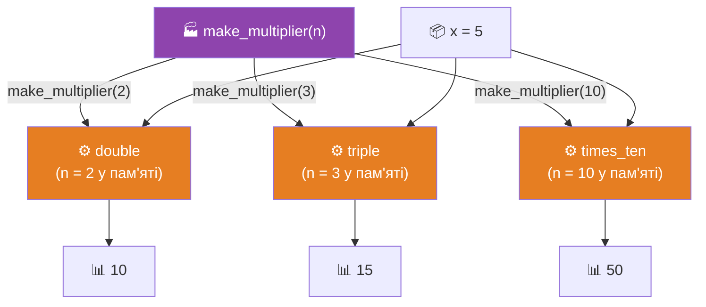
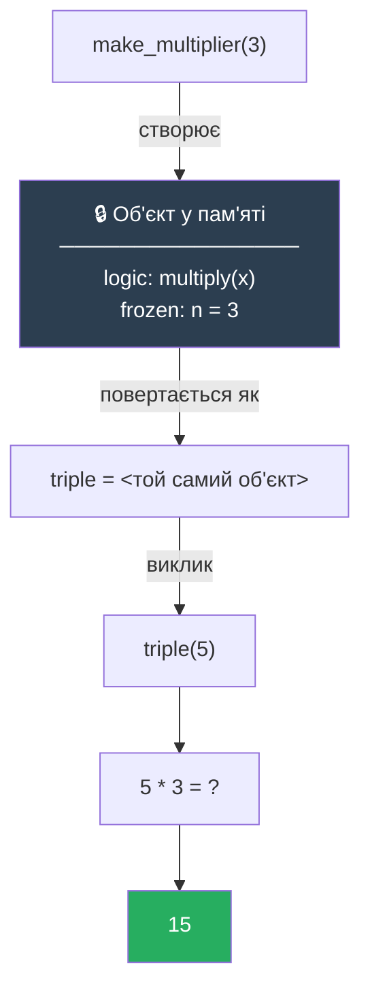
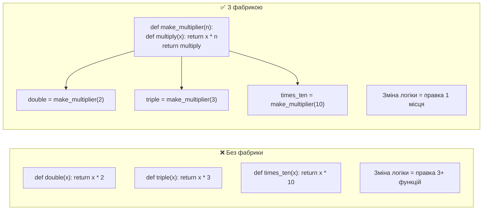

# Патерн 2: Function Factory (Фабрика функцій)

> **Рівень:** Beginner → Intermediate
> **Урок:** 13 — Functions as First-Class Objects
> **Модуль:** Module 2 — Python Intermediate

---

> 🧭 **Цей файл — не визначення. Це подорож.**
> Ти сам відкриєш Function Factory через реальну проблему дублювання.

---

> 🔗 **Зв'язок з попереднім патерном:**
> У Callback ти навчився **передавати** функцію. Тут ти навчишся **створювати** функцію.
> `Callback → "передати функцію"` · `Factory → "створити функцію"`

---

## 🔴 Крок 1 — Проблема: три функції-близнюки

Ти пишеш математичний модуль. Потрібно кілька операцій множення:

```python
def double(x):
    return x * 2

def triple(x):
    return x * 3

def times_ten(x):
    return x * 10
```

Виглядає нормально. Але подивись уважно.

---

❓ **Питання до тебе:**
Що в цих трьох функціях однакове? Що різне?

> Відповідь: логіка **однакова** (`x * n`). Різне лише **одне число** — 2, 3, 10.
> Ми написали один і той самий код тричі, змінивши одну цифру.

---

## 🟡 Крок 2 — Дублювання

Тепер уяви, що треба ще `times_five`, `times_hundred`, `times_pi`...

```python
def times_five(x):    return x * 5
def times_hundred(x): return x * 100
def times_pi(x):      return x * 3.14159
# ... ще 20 таких самих
```

І тут приходить баг: виявляється, треба округлювати результат до двох знаків.
Тобі треба знайти і виправити **кожну** функцію окремо.

```
❌ Дублювання коду — одна зміна вимагає N правок
❌ Легко пропустити одну функцію
❌ Логіка розсипана по 20 місцях
```

---

❓ **Питання:**
Яка частина коду є «спільною» для всіх цих функцій? Що ти хотів би написати лише раз?

---

## 💡 Крок 3 — Перший крок: параметр замість константи

Добре, зробимо очевидне — винесемо число в параметр:

```python
def multiply(x, n):
    return x * n

multiply(5, 2)   # 10
multiply(5, 3)   # 15
multiply(5, 10)  # 50
```

Одна функція замість двадцяти. Логіка — в одному місці.

---

❓ **Питання:**
Це рішення вирішує проблему дублювання. Але чи є ситуація, де воно не підходить?

---

## 🤔 Крок 4 — Але є одна проблема

Подивись на цей код:

```python
data = [3, 1, 4, 1, 5, 9, 2, 6]

# sorted очікує функцію з ОДНИМ аргументом
sorted(data, key=???)
```

Або callback-патерн з минулого уроку:

```python
process_data(10, callback=???)
```

Тут потрібна функція **з одним аргументом**. `multiply(x, n)` приймає два. Ти не можеш просто передати `multiply` — бо хто передасть `n`?

---

❓ **Питання:**
Як отримати функцію з одним аргументом, яка вже «знає» конкретне число?

---

## 🤯 Крок 5 — Злом: функція може створювати функцію

Ось ключова ідея. З уроку 13 ти знаєш: функція — це об'єкт. Об'єкт можна **повернути**.

> ❓ А що якщо функція **повертає іншу функцію**, вже налаштовану з конкретним числом?

Спробуємо подумати вголос:

```
Я хочу: double = "функція, яка множить на 2"

Ідея:
1. Пишу функцію make_multiplier(n)
2. Всередині визначаю функцію multiply(x): return x * n
3. Повертаю multiply — не результат, а сам об'єкт

Тоді: double = make_multiplier(2)
       double — це тепер функція multiply з n=2 всередині
```

---

## 💥 Крок 6 — Фабрика

```python
def make_multiplier(n):
    def multiply(x):
        return x * n      # n береться з зовнішнього scope!
    return multiply       # повертаємо функцію, а не результат


double    = make_multiplier(2)
triple    = make_multiplier(3)
times_ten = make_multiplier(10)

print(double(5))     # 10
print(triple(5))     # 15
print(times_ten(5))  # 50
```

Зупинись. Перечитай рядок `return multiply`.

`make_multiplier` не виконує `multiply`. Вона **повертає його як об'єкт**. Ти отримуєш функцію, вже готову до роботи — з числом `n` всередині.

---

❓ **Питання:**
Скільки разів ти написав логіку `x * n`? Один раз. Скільки функцій ти створив? Три.

---

🧩 **Мінівправа:**
Створи `times_pi = make_multiplier(3.14159)` і перевір `times_pi(10)`. Фабрика працює з будь-яким числом без жодних змін у коді.

---

## 🔒 Крок 7 — Магія замикання

Але виникає питання:

> ❓ Коли ти викликаєш `double(5)`, функція `make_multiplier` вже давно завершила роботу. Звідки `multiply` знає, що `n = 2`?

```python
double = make_multiplier(2)   # make_multiplier виконалась і "зникла"
print(double(5))               # але n=2 все ще відомо! Як?
```

Відповідь: **замикання (closure)**.

Коли `multiply` створювалась всередині `make_multiplier`, вона «побачила» змінну `n` у зовнішньому scope і **захопила її**. Python буквально зберіг значення `n=2` всередині об'єкта `double`.

Можеш перевірити:

```python
print(double.__closure__)                      # (<cell at 0x...>,)
print(double.__closure__[0].cell_contents)     # 2 — ось воно!
```

---

❓ **Питання:**
`double` і `triple` — це один і той самий об'єкт чи різні?

```python
print(double is triple)  # ?
```

> Відповідь: `False`. Кожен виклик `make_multiplier` створює **новий незалежний об'єкт** зі своїм `n` у замиканні.

---

## 🧠 Крок 8 — Інтуїція двома словами

```
Factory  = машина, що штампує функції
Closure  = пам'ять, вбудована в кожну функцію
```

Аналогія: **форма для печива**. Форма — це `make_multiplier`. Кожне печиво — `double`, `triple`, `times_ten`. Вони всі зроблені за однією логікою, але кожне «пам'ятає» свою форму.

```
make_multiplier(2)
       ↓
   створюється multiply(x)
   + в пам'яті заморожено n = 2
       ↓
   повертається як об'єкт
       ↓
double(5) → 5 * 2 → 10
```

---

## ⚙️ Крок 9 — Ще один приклад: HTML-тегер

```python
def create_tagger(tag):
    def tagger(text):
        return f"<{tag}>{text}</{tag}>"  # tag захоплено із зовнішнього scope
    return tagger


h1   = create_tagger("h1")
bold = create_tagger("b")
link = create_tagger("a")

print(h1("Заголовок"))    # <h1>Заголовок</h1>
print(bold("Важливо"))    # <b>Важливо</b>
print(link("Клікни"))     # <a>Клікни</a>
```

Один шаблон — нескінченна кількість варіантів. Ти не пишеш окремо `make_h1`, `make_bold`, `make_link`. Ти пишеш одну фабрику.

---

## 🔗 Крок 10 — Зв'язок з Callback

Тепер фабрика і callback разом:

```python
# Фабрика СТВОРЮЄ функцію з потрібною конфігурацією
double = make_multiplier(2)

# Callback ВИКОРИСТОВУЄ цю функцію
data = [1, 2, 3, 4, 5]
result = list(map(double, data))   # [2, 4, 6, 8, 10]

# Або у sorted:
words = ["banana", "fig", "apple"]
sorted(words, key=make_multiplier(1))   # будь-яка налаштована функція
```

Це і є справжня сила:
- **Factory** налаштовує поведінку один раз
- **Callback** підключає цю поведінку куди треба

```
Factory → "виготовити інструмент"
Callback → "використати інструмент"
```

---

## ⚠️ Крок 11 — Критична помилка

```python
double = make_multiplier(2)   # ✅ double — це функція
double = make_multiplier(2)() # ❌ double — це вже результат (число 0!)
                               #    make_multiplier(2) → функція
                               #    функція() → multiply(???) — немає аргументу!
```

Правило таке саме, як з callback: **без дужок = об'єкт, з дужками = виклик**.

---

❓ **Питання:**
Що поверне `make_multiplier(2)(5)`? Спробуй передбачити, потім перевір.

> Відповідь: `10`. Це ланцюжок: спочатку фабрика повертає функцію, потім функція одразу викликається з `5`.

---

## 📐 Діаграма: Фабрика штампує функції



---

## 📐 Діаграма: Замикання всередині



---

## 📐 Діаграма: Дублювання vs DRY



---

## 🌍 Де це в реальному світі

### `functools.partial` — вбудована фабрика

```python
from functools import partial

def power(base, exp):
    return base ** exp

# partial створює нову функцію з зафіксованим аргументом
square = partial(power, exp=2)
cube   = partial(power, exp=3)

print(square(4))  # 16
print(cube(3))    # 27
```

`functools.partial` — це стандартна бібліотечна фабрика. Ти уже зрозумів, як вона влаштована.

### Генерація валідаторів

```python
def make_range_validator(min_val, max_val):
    def validate(value):
        if not (min_val <= value <= max_val):
            raise ValueError(f"Має бути від {min_val} до {max_val}")
        return value
    return validate

validate_age    = make_range_validator(0, 120)
validate_score  = make_range_validator(0, 100)
validate_rating = make_range_validator(1, 5)

validate_age(25)     # ок
validate_score(150)  # ValueError: Має бути від 0 до 100
```

### Конфігурація логерів

```python
def make_logger(prefix):
    def log(message):
        print(f"[{prefix}] {message}")
    return log

info_log  = make_logger("INFO")
error_log = make_logger("ERROR")

info_log("Сервер запущено")     # [INFO] Сервер запущено
error_log("З'єднання втрачено") # [ERROR] З'єднання втрачено
```

---

## 🧩 Фінальне завдання

Напиши фабрику `make_power(n)`, яка повертає функцію для піднесення до степеня `n`:

```python
def make_power(n):
    # TODO

square = make_power(2)
cube   = make_power(3)

print(square(4))  # 16
print(cube(3))    # 27

# Бонус: використай make_power як callback у map
numbers = [1, 2, 3, 4, 5]
# squares = list(map(???, numbers))  # [1, 4, 9, 16, 25]
```

---

## 📋 Ключові правила

| Правило | Чому важливо |
|---|---|
| `return multiply` — без дужок | Повертаємо функцію-об'єкт, а не результат |
| Замикання захоплює `n` | Кожна створена функція «пам'ятає» свою конфігурацію |
| Кожен виклик фабрики → новий об'єкт | `double is triple` → `False` |
| Factory + Callback = пара | Factory виготовляє, Callback використовує |
| `functools.partial` | Вбудована фабрика — використовуй замість власної, де достатньо |
