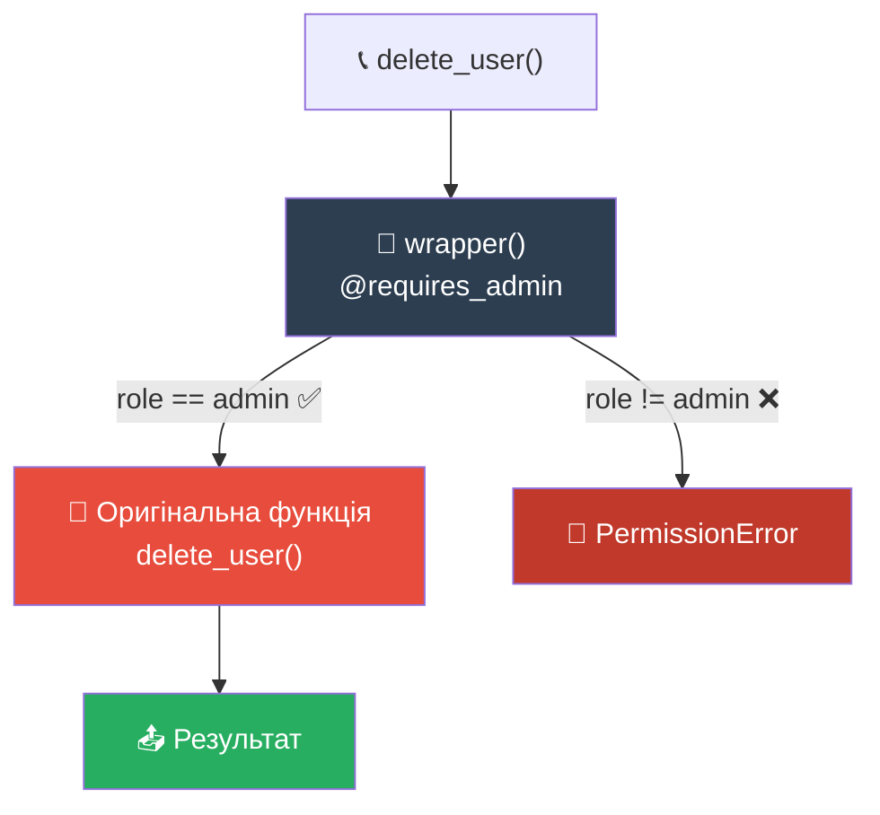
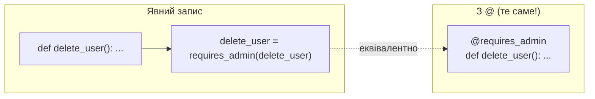
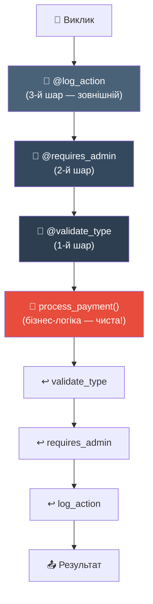

# Патерн 3: Decorator (Декоратор)

> **Рівень:** Beginner → Intermediate
> **Урок:** 13 — Functions as First-Class Objects
> **Модуль:** Module 2 — Python Intermediate

---

> 🧭 **Цей файл — не визначення. Це подорож.**
> Ми не будемо говорити тобі, що таке декоратор. Ти сам його придумаєш.

---

## 🔴 Крок 1 — Проблема

Ти пишеш систему. У ній є функція:

```python
USER_CONTEXT = {"role": "guest"}

def delete_user():
    print("Користувача видалено!")
```

Все добре. Але менеджер каже:

> «Ця функція має бути доступна **тільки адміністратору**. Гість не може видаляти.»

---

❓ **Питання до тебе:**
Як би ти це реалізував? Подумай 30 секунд перед тим, як читати далі.

---

## 🟡 Крок 2 — Наївне рішення

Перше, що спадає на думку:

```python
USER_CONTEXT = {"role": "guest"}

def delete_user():
    if USER_CONTEXT["role"] != "admin":
        raise PermissionError("Доступ заборонено!")
    print("Користувача видалено!")
```

Виглядає логічно. Перевіряємо роль — якщо не адмін, кидаємо помилку.

> 💡 `PermissionError` — це вбудований тип помилки Python для ситуацій «немає прав доступу». Ти не зобов'язаний його вигадувати — він вже є в мові.

---

❓ **Питання:**
Скільки часу займе це рішення, якщо подібних функцій не одна, а **50**?

---

## 🔴 Крок 3 — Дублювання

Проходить тиждень. Тепер таких функцій уже п'ять:

```python
def delete_user():
    if USER_CONTEXT["role"] != "admin":
        raise PermissionError("Доступ заборонено!")
    print("Користувача видалено!")

def create_user():
    if USER_CONTEXT["role"] != "admin":
        raise PermissionError("Доступ заборонено!")
    print("Користувача створено!")

def export_data():
    if USER_CONTEXT["role"] != "admin":
        raise PermissionError("Доступ заборонено!")
    print("Дані експортовано!")

# ... і ще 47 таких самих
```

Тепер уяви: бізнес-логіка змінилась. Тепер треба перевіряти не просто `"admin"`, а список ролей `["admin", "superuser"]`. Тобі треба знайти і змінити **50 місць**.

---

❓ **Питання:**
Що тут **справжня проблема**? Не «занадто багато коду», а щось глибше. Подумай.

> Відповідь: **перевірка доступу і бізнес-логіка перемішані в одному місці.** `delete_user` повинна знати тільки як видаляти користувача — але вона також змушена знати, хто має право це робити. Це дві різні відповідальності.

---

## 🟢 Крок 4 — Перша ідея: винести в окрему функцію

Добре. Давай винесемо перевірку:

```python
def check_admin():
    if USER_CONTEXT["role"] != "admin":
        raise PermissionError("Доступ заборонено!")

def delete_user():
    check_admin()  # виклик перевірки
    print("Користувача видалено!")

def create_user():
    check_admin()
    print("Користувача створено!")
```

Краще! Тепер логіка перевірки — в одному місці.

---

❓ **Питання:**
Але ми все ще пишемо `check_admin()` у кожній функції. Що ще не так?

> Відповідь: ми **залежимо від того, що хтось не забуде** написати `check_admin()` у кожній новій функції. Це людська помилка, яка чекає свого моменту.

---

🧩 **Мінівправа:**
Напиши ще одну функцію `ban_user()` і забудь додати `check_admin()`. Що станеться? Це і є проблема.

---

## 🤯 Крок 5 — Злом мозку: функція як об'єкт

А тепер зупинись. Ось питання, яке змінить все:

> ❓ Що якщо **функцію** можна передати в іншу функцію — як звичайне число або рядок?

Спробуємо:

```python
def delete_user():
    print("Користувача видалено!")

# Передаємо функцію як аргумент — БЕЗ дужок!
print(type(delete_user))   # <class 'function'>
print(delete_user)         # <function delete_user at 0x...>
```

`delete_user` без дужок — це **сам об'єкт-функція**. Він живе в пам'яті. Його можна передати, зберегти, повернути — так само, як число `42` або рядок `"hello"`.

---

❓ **Питання:**
Якщо функцію можна передати як аргумент — що ми могли б зробити з нею всередині іншої функції?

---

## ⚙️ Крок 6 — Передаємо функцію

Ось ідея: що якщо `check_admin` **отримає функцію** і виконає її **після** перевірки?

```python
def requires_admin(func):           # отримуємо функцію як об'єкт
    def wrapper():                  # нова функція — обгортка
        if USER_CONTEXT["role"] != "admin":
            raise PermissionError("🚫 Доступ заборонено!")
        return func()               # якщо все ок — викликаємо оригінал
    return wrapper                  # повертаємо обгортку як об'єкт
```

Що тут відбувається?

1. `requires_admin` отримує `func` — функцію, яку треба захистити
2. Всередині створюється `wrapper` — нова функція з перевіркою + оригіналом
3. `wrapper` повертається як об'єкт — не викликається, а **повертається**

---

❓ **Питання:**
Навіщо `return wrapper` замість `return wrapper()`? В чому різниця?

> Відповідь: `wrapper` — це об'єкт (рецепт). `wrapper()` — це вже виконання рецепту. Ми повертаємо рецепт, а не результат.

---

## 💥 Крок 7 — Магія заміни

Тепер дивись на це:

```python
USER_CONTEXT = {"role": "guest"}

def delete_user():
    print("Користувача видалено!")

# Замінюємо функцію на її захищену версію
delete_user = requires_admin(delete_user)

# Тепер delete_user — це wrapper!
delete_user()   # PermissionError: 🚫 Доступ заборонено!
```

```python
USER_CONTEXT = {"role": "admin"}
delete_user()   # Користувача видалено!
```

**Ім'я `delete_user` тепер вказує на `wrapper`**, а не на оригінальну функцію. Оригінал живе всередині wrapper — захоплений через замикання.

---

❓ **Питання:**
Чи змінили ми код самої функції `delete_user`? Ні! Ми лише **обгорнули** її ззовні. В чому перевага?

---

🧩 **Мінівправа:**
Напиши `create_user()` і захисти її через `requires_admin` без `@` — вручну, рядком `create_user = requires_admin(create_user)`.

---

## ✨ Крок 8 — Синтаксичний цукор `@`

Писати `delete_user = requires_admin(delete_user)` — це довго і некрасиво. Python дає скорочення:

```python
@requires_admin
def delete_user():
    print("Користувача видалено!")
```

Це **рівно те саме**, що й:

```python
def delete_user():
    print("Користувача видалено!")

delete_user = requires_admin(delete_user)
```

`@requires_admin` — не магія. Це просто коротший запис операції «передати функцію і замінити ім'я».

---

❓ **Питання:**
Коли Python читає рядок `@requires_admin`, чи виконується `delete_user` одразу?

> Відповідь: ні! `@requires_admin` лише **замінює** `delete_user` на `wrapper`. Виконання відбудеться, коли ти напишеш `delete_user()`.

---

🧩 **Мінівправа:**
Перепиши свій код `create_user` з попередньої вправи, замінивши ручну заміну на `@`-синтаксис.

---

## 🔐 Крок 9 — Повний приклад з поясненням

```python
USER_CONTEXT = {"role": "guest"}


def requires_admin(func):
    """Декоратор: дозволяє виконання тільки адміністраторам."""
    def wrapper(*args, **kwargs):
        # Читаємо роль з контексту
        role = USER_CONTEXT.get("role")

        # Якщо роль не "admin" — зупиняємо виконання
        if role != "admin":
            raise PermissionError(
                f"🚫 Доступ заборонено. Роль '{role}' не має прав адміністратора."
            )

        # Якщо все ок — передаємо виклик оригінальній функції
        return func(*args, **kwargs)

    return wrapper


# Три функції — один декоратор
@requires_admin
def delete_user():
    print("Користувача видалено!")

@requires_admin
def export_data():
    print("Дані експортовано!")

@requires_admin
def create_user(name):
    print(f"Користувача '{name}' створено!")


# Тест 1: гість
try:
    delete_user()
except PermissionError as e:
    print(e)   # 🚫 Доступ заборонено. Роль 'guest'...

# Тест 2: адмін
USER_CONTEXT["role"] = "admin"
create_user("Alice")   # Користувача 'Alice' створено!
```

> 💡 **`*args, **kwargs` у wrapper** — це «прозорий тунель». Wrapper не знає, скільки аргументів приймає оригінальна функція — він просто передає все далі. Саме тому один декоратор підходить для будь-якої функції.

> 💡 **`PermissionError`** — стандартний тип помилки Python для ситуацій відмови в доступі. Ти можеш перехопити його через `try/except PermissionError`.

---

❓ **Питання:**
Навіщо `*args, **kwargs` у `wrapper`, якщо `delete_user` не приймає жодних аргументів?

> Відповідь: декоратор `requires_admin` універсальний. Ти застосовуєш його і до `delete_user()`, і до `create_user(name)`. Щоб він підходив для **будь-якої** функції — wrapper має бути гнучким.

---

## 🧠 Крок 10 — Інтуїція: метафора охоронця

```
                  ┌──────────────────────────────┐
                  │     @requires_admin          │
                  │                              │
  Виклик ──────►  │  🔐 Охоронець перевіряє     │
  delete_user()   │     посвідчення              │
                  │           │                  │
                  │    admin? │ guest?           │
                  │           ▼        ▼         │
                  │      ✅ Пропускає  ❌ Зупиняє │
                  │           │                  │
                  │           ▼                  │
                  │  🎯 delete_user() виконується│
                  └──────────────────────────────┘
```

Охоронець стоїть **перед дверима**. Ти не змінюєш кімнату за дверима — ти просто додаєш охоронця зовні.

Це і є декоратор: **додаткова поведінка ззовні, без зміни оригіналу**.

---

## 📐 Діаграма: Структура декоратора



---

## 📐 Діаграма: `@` як скорочення



---

## 📐 Діаграма: Стек декораторів — middleware

Декоратори можна **ставити один на одного**. Запит проходить через усі шари:



> Декоратори застосовуються **знизу вгору**: спочатку `@validate_type`, потім `@requires_admin`, потім `@log_action`.

---

## 🌍 Де це використовується в реальних фреймворках

Тепер ти розумієш механізм — і код фреймворків більше не виглядає магією.

### FastAPI

```python
@app.get("/users/{id}")
def get_user(id: int):
    return {"id": id}
```

`@app.get(...)` — це **фабрика декораторів**. Вона реєструє функцію як обробник HTTP-запиту. Коли приходить запит `GET /users/42`, FastAPI знаходить зареєстровану функцію і викликає її. Твоя функція — чиста бізнес-логіка. Декоратор бере на себе HTTP-протокол.

### Django

```python
@login_required
def dashboard(request):
    return render(request, "dashboard.html")
```

`@login_required` — рівно той самий патерн, що ти щойно написав сам. Перевірка сесії відбувається у wrapper, `dashboard` не знає про авторизацію.

### pytest

```python
@pytest.mark.skip(reason="Ще не реалізовано")
def test_refund():
    assert refund(100) == 100
```

`@pytest.mark.skip` — декоратор, що додає метадані до функції-тесту. pytest читає ці метадані і пропускає тест.

### Python stdlib

```python
@functools.lru_cache(maxsize=128)
def fibonacci(n):
    ...
```

`@lru_cache` — wrapper, що перехоплює кожен виклик. Якщо результат вже є в кеші — повертає його миттєво, не виконуючи функцію.

---

## ⚠️ Золоте правило: `@functools.wraps`

Є одна пастка. Після огортання функція **втрачає ім'я**:

```python
@requires_admin
def delete_user():
    """Видаляє користувача."""
    pass

print(delete_user.__name__)   # 'wrapper' ← неправильно!
print(delete_user.__doc__)    # None       ← втрачено!
```

Виправляється одним рядком:

```python
import functools

def requires_admin(func):
    @functools.wraps(func)    # ← копіює __name__, __doc__ з оригіналу
    def wrapper(*args, **kwargs):
        ...
    return wrapper
```

> **Правило:** у production-коді завжди додавай `@functools.wraps(func)`. Без нього ламаються логи, автодокументація FastAPI, pytest-репорти.

---

## 🧩 Фінальна вправа

Напиши декоратор `@requires_role(role)` — **фабрику декораторів**, яка приймає роль як параметр:

```python
@requires_role("admin")
def delete_user():
    print("Видалено!")

@requires_role("moderator")
def hide_comment():
    print("Сховано!")
```

Підказка: потрібно три рівні — `requires_role(role)` → `real_decorator(func)` → `wrapper(*args, **kwargs)`.

---

## 📋 Ключові правила

| Правило | Чому важливо |
|---|---|
| `return wrapper` — без дужок | Повертаємо функцію-об'єкт, а не результат її виклику |
| `*args, **kwargs` у wrapper | Декоратор універсальний для будь-якої сигнатури |
| `@functools.wraps(func)` | Зберігає `__name__`, `__doc__` — не ламає інструменти |
| Декоратори знизу вгору | `@A @B def f` → `f = A(B(f))` — `B` виконується першим |
| Одна відповідальність | Декоратор робить одну річ. Не мішай логування і авторизацію в одному |
