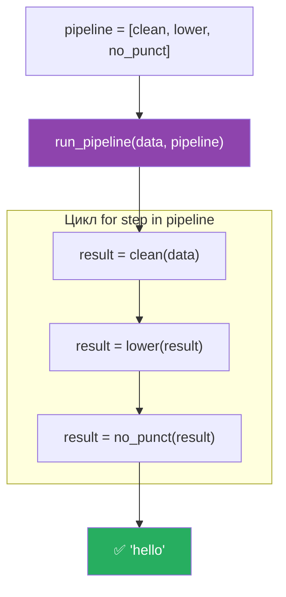
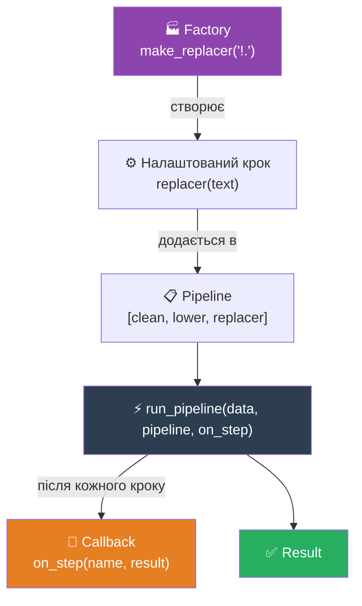
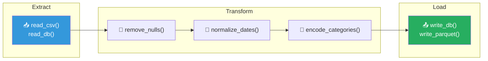

# Патерн 4: Pipeline (Пайплайн)

> **Рівень:** Beginner → Intermediate
> **Урок:** 13 — Functions as First-Class Objects
> **Модуль:** Module 2 — Python Intermediate

---

> 🧭 **Цей файл — не визначення. Це подорож.**
> Ти сам відкриєш Pipeline через реальну задачу обробки тексту.

---

> 🔗 **Де ми зараз у карті патернів:**
>
> | Патерн | Ідея |
> |---|---|
> | Callback | **передати** функцію |
> | Factory | **створити** функцію |
> | Decorator | **обгорнути** функцію |
> | **Pipeline** | **з'єднати** функції у потік |

---

## 🔴 Крок 1 — Проблема

Є рядок:

```python
text = "  HELLO!  "
```

Завдання: отримати `"hello"` — без пробілів, малими літерами, без знаків пунктуації.

---

❓ **Питання до тебе:**
Як би ти це написав? Спробуй самостійно перед тим, як читати далі.

---

## 🟡 Крок 2 — Наївне рішення

```python
text = "  HELLO!  "

text = text.strip()       # "HELLO!"
text = text.lower()       # "hello!"
text = text.replace("!", "")  # "hello"

print(text)  # hello
```

Працює. Але подивись, що тут відбувається: ми тричі перезаписуємо одну змінну `text`. Код лінійний — крок за кроком.

---

❓ **Питання:**
А якщо таких кроків не три, а десять? І їх порядок іноді треба міняти?

---

## 🔴 Крок 3 — Коли це стає проблемою

Уяви реальну задачу: текстовий препроцесор для NLP. Кроки:

```python
text = text.strip()
text = text.lower()
text = text.replace("!", "")
text = text.replace(".", "")
text = text.replace(",", "")
text = remove_html_tags(text)
text = expand_contractions(text)
text = remove_stopwords(text)
text = stem_words(text)
text = normalize_unicode(text)
```

```
❌ Код — один монолітний блок. Важко читати.
❌ Щоб поміняти порядок кроків — треба переставляти рядки вручну.
❌ Хочеш вимкнути один крок — мусиш коментувати рядок і пам'ятати де він.
❌ Хочеш перевикористати цей набір кроків в іншому місці — copy-paste.
❌ Хочеш логувати кожен крок — додаєш print у 10 місцях.
```

---

❓ **Питання:**
Яка головна проблема тут — не кількість рядків, а щось глибше. Що саме?

> Відповідь: **дані і кроки обробки перемішані**. Ми не можемо окремо говорити про «що робимо» і «з чим робимо». Немає структури.

---

## 💡 Крок 4 — Ідея: кожен крок — окрема функція

Що якщо кожну трансформацію винести в окрему функцію?

```python
def clean(text):
    return text.strip()

def lower(text):
    return text.lower()

def no_punct(text):
    return text.replace("!", "").replace(".", "").replace(",", "")
```

Тепер кожна функція — одна відповідальність. Але як їх з'єднати?

---

❓ **Питання:**
З уроку 13 ти знаєш, що функції можна зберігати у списку. Що якщо скласти ці функції у список? Що це дасть?

---

## 🤯 Крок 5 — Злом: список функцій = список кроків

```python
# Функції — це об'єкти. Їх можна покласти у список.
pipeline = [clean, lower, no_punct]

# Список кроків можна читати як інструкцію:
# 1. clean → 2. lower → 3. no_punct
```

Але як тепер передати дані через цей список? Написати runner.

---

## ⚙️ Крок 6 — Runner

```python
def run_pipeline(data, pipeline):
    result = data
    for step in pipeline:        # ітеруємо по функціях як по звичайних даних
        result = step(result)    # вихід одного кроку = вхід наступного
    return result
```

Це весь runner. Шість рядків. Він нічого не знає про `clean`, `lower`, `no_punct` — лише про те, що кожен елемент списку є функцією, яку можна викликати.

---

## 💥 Крок 7 — Результат

```python
print(run_pipeline("  HELLO!  ", pipeline))
# hello
```

```
"  HELLO!  "
      ↓  clean
  "HELLO!"
      ↓  lower
  "hello!"
      ↓  no_punct
  "hello"
```

---

❓ **Питання:**
Що саме зберігається у змінній `pipeline`? Це рядки? Числа? Що?

> Відповідь: список об'єктів-функцій. `pipeline[0]` — це `clean`, `pipeline[1]` — `lower`. Ти можеш перевірити: `print(pipeline[0].__name__)` → `'clean'`.

---

🧩 **Мінівправа:**
Додай четверту функцію `exclaim(text): return text + "!"` і додай її в кінець `pipeline`. Переконайся, що `run_pipeline` не змінився ні на рядок.

---

## ⚠️ Крок 8 — Порядок має значення

```python
# Оригінальний порядок:
pipeline_a = [clean, lower, no_punct]
print(run_pipeline("  HELLO!  ", pipeline_a))   # "hello"

# Змінили порядок:
pipeline_b = [lower, clean, no_punct]
print(run_pipeline("  HELLO!  ", pipeline_b))   # "hello" — тут те саме

# Але уяви, що no_punct видаляє пробіли, а clean — теж:
pipeline_c = [no_punct, lower, clean]
# Результат може бути інший в залежності від логіки функцій
```

> 🏗️ **Архітектурний принцип:** порядок кроків — це частина бізнес-логіки. Pipeline робить його **явним і видимим** — ти бачиш список і одразу розумієш послідовність.

---

❓ **Питання:**
Якщо у тебе є `pipeline = [clean, lower, no_punct]` і ти хочеш вимкнути крок `lower` — як це зробити, не видаляючи функцію?

> Підказка: просто прибери її зі списку. Сама функція `lower` залишається в коді — але не виконується.

---

## 🔥 Крок 9 — Динамічний пайплайн

Список — це звичайні дані. Його можна змінювати під час виконання:

```python
pipeline = [clean, lower, no_punct]

# Додаємо крок без зміни runner або існуючих функцій
pipeline.append(lambda text: text + "!!!")
print(run_pipeline("  HELLO!  ", pipeline))   # "hello!!!"

# Або будуємо пайплайн умовно:
steps = [clean, lower]
if remove_punctuation_needed:
    steps.append(no_punct)
if add_exclamation:
    steps.append(lambda x: x + "!")

run_pipeline(data, steps)
```

---

❓ **Питання:**
Як це співвідноситься з тим, що ти знаєш про списки? Чим список функцій відрізняється від списку чисел?

> Відповідь: нічим, з точки зору Python. Список функцій — це просто список об'єктів. Різниця лише в тому, що ці об'єкти можна викликати.

---

## 🔗 Крок 10 — Pipeline + попередні патерни

Тепер поєднаємо все, що знаємо.

### Pipeline + Callback: логування кожного кроку

```python
def run_pipeline(data, pipeline, on_step=None):
    result = data
    for step in pipeline:
        result = step(result)
        if on_step:
            on_step(step.__name__, result)   # callback після кожного кроку
    return result


def log_step(name, value):
    print(f"  [{name}] → '{value}'")


run_pipeline("  HELLO!  ", pipeline, on_step=log_step)
# [clean]   → 'HELLO!'
# [lower]   → 'hello!'
# [no_punct] → 'hello'
```

### Pipeline + Factory: налаштовані кроки

```python
def make_replacer(chars):
    """Фабрика: створює функцію, що видаляє задані символи."""
    def replacer(text):
        for char in chars:
            text = text.replace(char, "")
        return text
    return replacer


# Тепер кроки — налаштовані через фабрику
pipeline = [
    clean,
    lower,
    make_replacer("!.,;:?"),   # видаляємо будь-який набір символів
]

print(run_pipeline("  HELLO, World!  ", pipeline))   # "hello world"
```

### Pipeline + Decorator: логування без зміни функцій

```python
def log(func):
    """Декоратор: логує вхід і вихід кроку."""
    def wrapper(data):
        result = func(data)
        print(f"  [{func.__name__}]: '{data}' → '{result}'")
        return result
    return wrapper


# Огортаємо кожен крок логуванням через list comprehension
logged_pipeline = [log(step) for step in pipeline]
run_pipeline("  HELLO!  ", logged_pipeline)
```

---

## 📐 Діаграма: Дані течуть через станції


---

## 📐 Діаграма: Runner ітерує по функціях



---

## 📐 Діаграма: Три патерни разом



---

## 🌍 Де це в реальному світі

### Pandas `.pipe()`

```python
import pandas as pd

def remove_nulls(df):
    return df.dropna()

def normalize_names(df):
    df["name"] = df["name"].str.lower().str.strip()
    return df

def add_age_group(df):
    df["age_group"] = df["age"].apply(lambda x: "young" if x < 30 else "adult")
    return df

# Пайплайн з Pandas — той самий патерн
df = (pd.read_csv("users.csv")
        .pipe(remove_nulls)
        .pipe(normalize_names)
        .pipe(add_age_group))
```

### scikit-learn Pipeline

```python
from sklearn.pipeline import Pipeline
from sklearn.preprocessing import StandardScaler
from sklearn.linear_model import LogisticRegression

# Той самий патерн — список кроків
ml_pipeline = Pipeline([
    ("scaler", StandardScaler()),
    ("model",  LogisticRegression()),
])

ml_pipeline.fit(X_train, y_train)
ml_pipeline.predict(X_test)
```

### Unix pipes

```bash
# Те саме в командному рядку — дані течуть зліва направо
cat server.log | grep "ERROR" | sort | uniq -c | sort -rn
```

```
cat       → читає файл
grep      → фільтрує рядки
sort      → сортує
uniq -c   → рахує унікальні
sort -rn  → сортує за кількістю
```

Кожна команда — окремий «крок». `|` — це і є runner.

---

## 📐 Діаграма: ETL пайплайн



---

## 🧩 Фінальне завдання

```python
def reverse(text):
    return text[::-1]

def capitalize_first(text):
    return text.capitalize()
```

1. Додай `reverse` і `capitalize_first` у пайплайн нижче і передбач результат:

```python
pipeline = [clean, lower, no_punct, reverse, capitalize_first]
print(run_pipeline("  HELLO!  ", pipeline))   # ?
```

2. Побудуй **логований** пайплайн через декоратор `log` — щоб бачити кожен крок.

3. ⭐ **Бонус:** напиши `make_replacer(chars)` і зроби пайплайн, де `no_punct` замінений на налаштований через фабрику крок.

---

## 🏗️ Архітектурна ідея

```
Pipeline = orchestration layer   (знає порядок, не знає деталей)
Functions = processing units     (знають деталі, не знають порядку)
```

Це і є **розділення відповідальностей**:
- Кожна функція — одна операція
- Runner — тільки оркестрація
- Список — явна конфігурація порядку

Саме тому великі дата-системи (Airflow, Spark, scikit-learn) побудовані на цьому патерні: легко читати, легко тестувати кожен крок окремо, легко міняти порядок.

---

## 📋 Ключові правила

| Правило | Чому важливо |
|---|---|
| Кожен крок — чиста функція | Один вхід, один вихід — легко тестувати ізольовано |
| Runner нічого не знає про кроки | Можна підміняти будь-який крок без зміни runner |
| Порядок у списку = порядок виконання | Явна конфігурація, видима одразу |
| `pipeline.append(func)` | Розширення без зміни існуючого коду |
| Factory + Pipeline | Фабрика налаштовує крок, pipeline його використовує |
