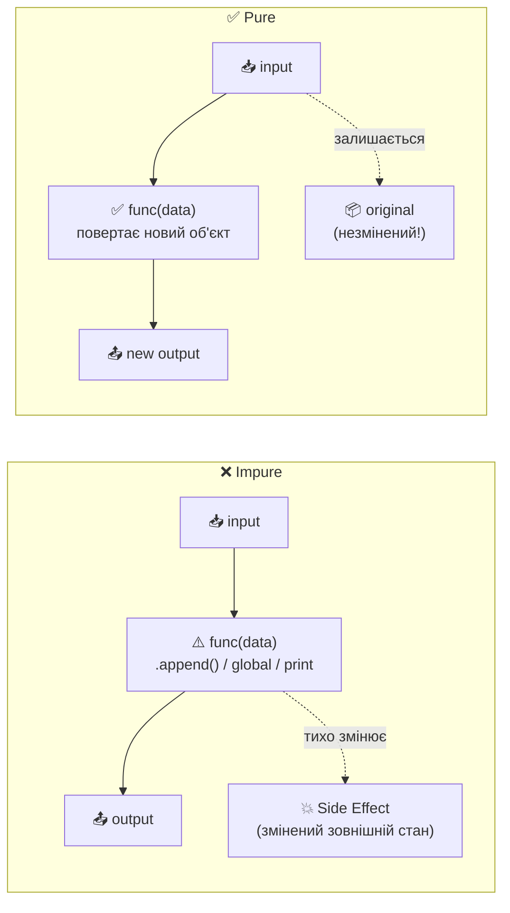
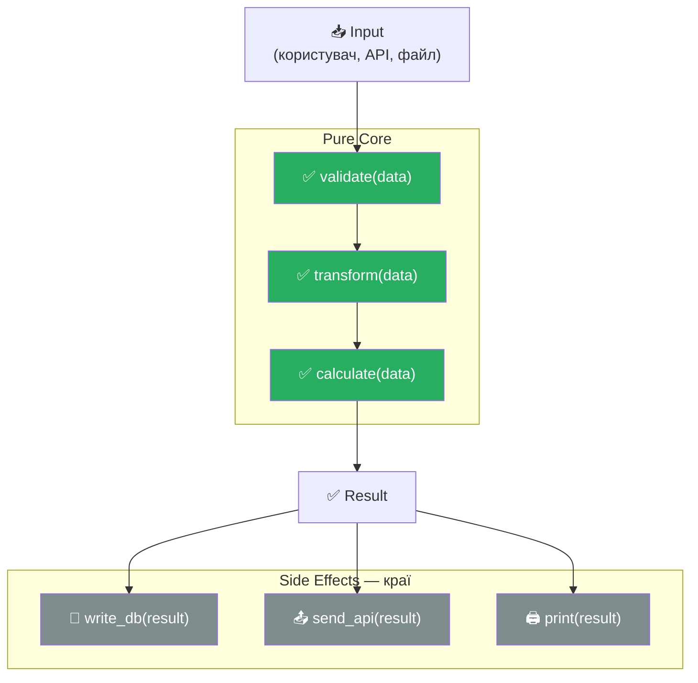
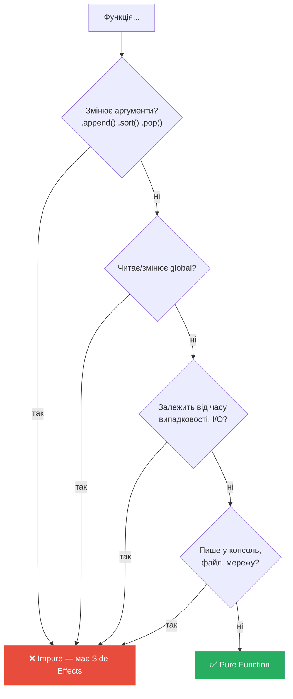

# Патерн 5: Pure Functions & Immutability (Чисті функції)

> **Рівень:** Beginner → Intermediate
> **Урок:** 13 — Functions as First-Class Objects
> **Модуль:** Module 2 — Python Intermediate

---

> 🧭 **Цей файл — не визначення. Це подорож.**
> Ти сам відчуєш проблему — і сам зрозумієш рішення.

---

> 🔗 **Де ми зараз у карті патернів:**
>
> | Патерн | Ідея |
> |---|---|
> | Callback | передати функцію |
> | Factory | створити функцію |
> | Decorator | обгорнути функцію |
> | Pipeline | з'єднати функції у потік |
> | **Pure Functions** | **зробити функції безпечними** |

Pipeline з попереднього уроку працює добре — але тільки якщо функції всередині **не ламають одна одну тихо**. Саме про це цей файл.

---

## 🔴 Крок 1 — Проблема

Ось функція, яка додає елемент до списку:

```python
def add_item(data, item):
    data.append(item)   # додаємо в оригінальний список
    return data

my_list = [1, 2, 3]
result = add_item(my_list, 4)

print(result)    # [1, 2, 3, 4] — очікувано
print(my_list)   # [1, 2, 3, 4] — СЮРПРИЗ!
```

---

❓ **Питання до тебе:**
Ти передав `my_list` у функцію і отримав результат. Але чому `my_list` змінився? Ти його не чіпав після виклику.

> Відповідь: списки в Python передаються **за посиланням**. `data` і `my_list` — це два імені для **одного об'єкту** в пам'яті. Коли `data.append(item)` змінює об'єкт — `my_list` теж «бачить» зміну, бо дивиться на той самий об'єкт.

---

## 💥 Крок 2 — Чому це небезпечно

Це називається **побічний ефект (side effect)** — функція змінила щось за межами своїх вхідних і вихідних значень.

Тепер уяви такий сценарій:

```python
def process_order(cart, item):
    cart.append(item)
    return cart

def calculate_total(cart):
    # очікує незмінений оригінальний кошик
    return sum(cart)

my_cart = [100, 200]

final_cart = process_order(my_cart, 50)
total = calculate_total(my_cart)   # очікуємо 300, але отримаємо 350!
```

`process_order` **тихо змінила** `my_cart`. `calculate_total` нічого не знала про це і отримала неправильні дані.

```
❌ Баги, що важко знайти — код виглядає правильно, але дані пошкоджені
❌ Порядок викликів важливий — перестав місцями і все зламається
❌ Важко тестувати — результат залежить від того, хто і коли змінив стан
```

---

❓ **Питання:**
Якщо таку функцію використовують у 10 різних місцях, і кожна з них змінює оригінальний список — хто і коли зламав дані? Як це дебажити?

---

## 💡 Крок 3 — Ідея

> ❓ А що якщо функція **ніколи** не змінює дані, які їй передали?
> Замість цього — повертає **новий об'єкт** з потрібними змінами.

---

## ✅ Крок 4 — Чиста функція

```python
def add_item(data, item):
    return data + [item]   # створюємо НОВИЙ список, оригінал не чіпаємо

my_list = [1, 2, 3]
result = add_item(my_list, 4)

print(result)    # [1, 2, 3, 4] — новий список
print(my_list)   # [1, 2, 3]   — оригінал незмінний
```

Різниця одна: `data.append(item)` проти `return data + [item]`.
Але наслідки — кардинально різні.

---

❓ **Питання:**
Чому `data + [item]` не змінює оригінал, а `data.append(item)` — змінює?

> Відповідь: оператор `+` для списків **завжди створює новий об'єкт**. `append` **мутує існуючий** об'єкт на місці. Перевір: `id(data)` до і після — з `+` id буде різний, з `append` — той самий.

---

🧩 **Мінівправа:**
Перевір це сам:

```python
a = [1, 2, 3]
b = a + [4]
print(id(a) == id(b))   # False — різні об'єкти

a = [1, 2, 3]
a.append(4)
print(a)                # [1, 2, 3, 4] — той самий об'єкт змінився
```

---

## 🧠 Крок 5 — Тепер можна дати визначення

Тільки зараз, після того як ти відчув проблему, визначення має сенс:

**Чиста функція (Pure Function)** — це функція, яка:
1. При однакових вхідних даних **завжди повертає однаковий результат**
2. **Не має побічних ефектів** — не змінює нічого за межами свого scope

```
Чистий "чорний ящик":

  input
    ↓
┌─────────┐
│  func   │
└─────────┘
    ↓
  output

Більше нічого не відбувається. Ніяких змін зовні.
```

---

## ❌ Крок 6 — Нечисті функції: три приклади

### Тип 1: Мутація аргументу

```python
def impure(data, item):
    data.append(item)    # ← side effect: змінює зовнішній об'єкт
    return data
```

### Тип 2: Залежність від зовнішнього стану

```python
import time

def impure():
    return time.time()   # ← не pure: результат залежить від моменту виклику
                          #   однаковий input (нічого) → різний output
```

### Тип 3: Зміна глобального стану

```python
COUNTER = 0

def impure():
    global COUNTER
    COUNTER += 1         # ← side effect: змінює глобальну змінну
    return COUNTER
```

### Тип 4: I/O — `print` теж не чиста!

```python
def impure(text):
    print(text)          # ← side effect: запис у консоль — це зовнішній ефект
    return text
```

---

❓ **Питання:**
Чи є `print` чистою функцією?

> Відповідь: **ні**. `print` записує у стандартний вивід — це взаємодія з зовнішнім світом. Той самий виклик `print("hello")` кожного разу щось змінює (консоль). Side effect — навіть якщо він «нешкідливий».

---

❓ **Питання:**
Чи є чистою функція, яка читає з бази даних? А яка пише в базу?

> Відповідь: обидві нечисті. Читання з БД може повернути різний результат при однакових аргументах (хтось міг змінити дані). Запис — явний side effect.

---

## 🔥 Крок 7 — Чому це важливо: чотири причини

### 1. Передбачуваність

```python
# Pure function — можна передбачити без контексту:
add_item([1, 2], 3)   # завжди [1, 2, 3], без питань

# Impure function — треба знати стан системи:
global_add(3)          # а що там зараз у глобальному списку?
```

### 2. Тестування

```python
# Pure function тестується без жодного setup:
assert add_item([1, 2], 3) == [1, 2, 3]   # одна строчка, все

# Impure function потребує setup і teardown:
# треба ініціалізувати глобальний стан перед тестом
# і очищати після — інакше тести впливають одне на одного
```

### 3. Кешування

```python
from functools import lru_cache

# @lru_cache ПРАЦЮЄ тільки з pure functions:
# однаковий input → однаковий output → можна зберегти результат
@lru_cache(maxsize=None)
def fibonacci(n):
    if n < 2: return n
    return fibonacci(n-1) + fibonacci(n-2)

# Для impure — кешування дасть неправильні результати!
# Кеш поверне старий результат, а стан зовні вже змінився.
```

### 4. Паралелізм

```python
# Pure functions безпечні для паралельного виконання:
# немає shared state → немає race conditions → немає deadlocks

# Impure functions з глобальним станом потребують locks,
# мютексів і складної синхронізації.
```

---

## 🔗 Крок 8 — Зв'язок з Pipeline

Пам'ятаєш пайплайн з попереднього патерну?

```python
pipeline = [clean, lower, no_punct]
run_pipeline("  HELLO!  ", pipeline)
```

Він працює **тільки тому**, що `clean`, `lower`, `no_punct` — чисті функції. Вони беруть рядок і повертають новий рядок. Нічого не змінюють зовні.

А тепер уяви нечисту функцію в пайплайні:

```python
log = []

def dirty_lower(text):
    log.append(text)    # ← side effect: змінює зовнішній список!
    return text.lower()

pipeline = [clean, dirty_lower, no_punct]
run_pipeline("  HELLO!  ", pipeline)
run_pipeline("  WORLD!  ", pipeline)

print(log)  # ['HELLO!', 'WORLD!'] — хтось накопичив стан тихо
```

Якщо ти запустиш пайплайн кілька разів — `log` буде рости. Якщо тестуватимеш — стан між тестами буде забруднений. **Пайплайн стає непередбачуваним.**

---

❓ **Питання:**
Як виправити `dirty_lower`? Як залишити логування, але зробити функцію чистою?

> Відповідь: логування — це side effect. Його треба **винести назовні** — наприклад, у callback `on_step` (як ми робили в Pipeline-патерні). Функція залишається чистою, а логування — окремим шаром.

---

## 🏗️ Крок 9 — Архітектурна ідея

В реальних системах **неможливо уникнути** побічних ефектів — без `print`, баз даних і API нічого не буде. Але можна **організувати** де вони живуть:

```
┌─────────────────────────────────┐
│         PURE CORE               │  ← вся бізнес-логіка тут
│   clean() lower() validate()    │     чисті функції, легко тестувати
│   calculate() transform()       │
└────────────┬────────────────────┘
             │ дані течуть через pipeline
┌────────────▼────────────────────┐
│         SIDE EFFECTS            │  ← взаємодія з зовнішнім світом
│   print() / write_db()          │     тільки на краях системи
│   send_api() / log_file()       │
└─────────────────────────────────┘
```

Чисті функції — **серцевина**. Побічні ефекти — **краї**.

Саме так побудовані великі системи: React (pure components), Redux (pure reducers), Haskell (IO monad виносить side effects в окремий шар), FastAPI (endpoint-функції чисті, framework бере на себе HTTP).

---

## 📐 Діаграма: Pure vs Impure



---

## 📐 Діаграма: Архітектура Pure Core



---

## 📐 Діаграма: Виявлення side effects



---

## 🧩 Фінальне завдання

**Частина 1:** Визнач, яка з функцій чиста, яка — ні. Поясни чому.

```python
def f1(x):
    return x * 2

def f2(data):
    data.sort()
    return data

def f3(text):
    return text.strip().lower()

def f4():
    return random.random()

def f5(a, b):
    print(f"Adding {a} + {b}")
    return a + b

def f6(items, new_item):
    return items + [new_item]
```

**Частина 2:** Виправ нечисті функції з частини 1 — зроби їх чистими (де це можливо).

**Частина 3 ⭐:** Візьми пайплайн з попереднього патерну і переконайся, що кожна функція в ньому чиста. Якщо хочеш логування — додай його через callback `on_step`, не всередину функцій.

---

## 📋 Ключові правила

| Правило | Чому важливо |
|---|---|
| Не мутуй аргументи | Повертай `data + [item]`, не `data.append(item)` |
| Не читай global | Передавай все через параметри |
| Той самий input = той самий output | Завжди, без винятків |
| Side effects — на краях | I/O, print, DB — тільки після pure core |
| Pure functions = кешуються | `@lru_cache` працює тільки з pure |
| Pure functions = паралелізуються | Немає shared state → немає race conditions |
